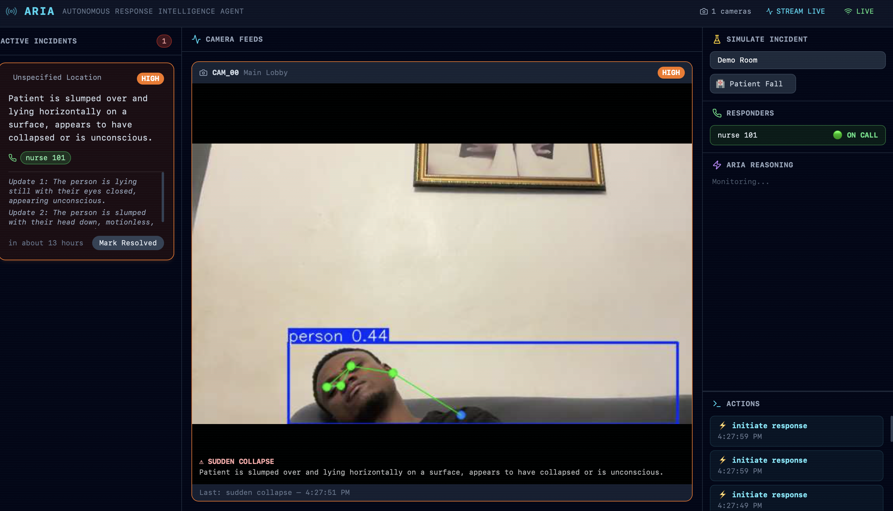

# ARIA — Autonomous Response Intelligence Agent

> **She sees everything. She calls everyone.**
>
> A real-time AI safety agent that watches live camera feeds, detects patient falls using YOLO Pose skeleton tracking, confirms via Gemini Realtime visual AI, and automatically dispatches responders via phone calls and Telegram alerts — all autonomously.

Built for the [Vision Possible: Agent Protocol](https://wemakedevs.org) hackathon by WeMakeDevs x GetStream.

---

## Demo



*ARIA detects a patient collapse via YOLO Pose skeleton tracking → Gemini Realtime confirms visually → nurse 101 called automatically → live situational updates on the incident card.*

**What ARIA detects:**
- **Patient Fall / Sudden Collapse** — Gemini Realtime watches the live camera feed and proactively detects when a patient falls, collapses, or goes down. YOLO Pose provides 17-keypoint skeleton overlay for visual monitoring.

---

## How It Works

```
Camera (5fps) ──► VideoForwarder ──┬──► YOLO Pose (skeleton + fall detection)
                                   │        │
                                   │   IncidentEvent ──► Gemini confirms
                                   │                         │
                                   └──► Gemini Realtime      │
                                        (continuous video AI) │
                                                              ▼
                                                     ┌─────────────────┐
                                                     │  DISPATCH        │
                                                     │  Phone Call      │
                                                     │  Telegram Alert  │
                                                     │  Dashboard WS    │
                                                     └─────────────────┘
```

### The Pipeline

1. **YOLO Pose** processes every frame at 5fps — draws 17-keypoint skeleton overlays, tracks bounding box motion and body position
2. **Fall detection** triggers when YOLO detects rapid downward motion (bbox center-Y drops), body shrinkage (person going horizontal), or skeleton horizontal position (shoulders ≈ hips ≈ ankles Y-coordinate)
3. **Gemini Realtime** (watching the same camera at 5fps via `VideoForwarder`) receives a `[VISION ALERT]` and visually confirms or rejects the fall using the live video
4. If confirmed, Gemini calls `initiate_response` via tool calling — no human in the loop
5. **Clawtunnel** (custom telephony platform, also built by me) originates a real phone call to the on-duty nurse/responder
6. **Live TTS briefing** — as the responder answers, Gemini describes the current scene and whispers it via text-to-speech into the call
7. **Telegram bot** simultaneously sends a snapshot image with alert details to the responder's phone
8. **Dashboard** shows everything in real-time: camera feed with skeleton overlay, ARIA's reasoning, responder call status, incident timeline

---

## Architecture

```
┌────────────────────────────────────────────────────────────────────────┐
│                           ARIA System                                  │
├──────────────────┬─────────────────────┬───────────────────────────────┤
│  VISION LAYER    │  INTELLIGENCE       │  RESPONSE LAYER               │
│                  │  LAYER              │                               │
│  OpenCV Camera   │                     │  Clawtunnel Telephony         │
│  (local webcam)  │  Gemini Realtime    │  (voice.clawtunnel.com)       │
│       │          │  (Live API 5fps)    │  ┌───────────────────────┐    │
│  YOLO Pose       │       │             │  │ Phone Call Dispatch   │    │
│  (yolo11n-pose)  │  Tool Calling:      │  │ Live TTS Briefings    │    │
│  17 keypoints    │  • initiate_resp.   │  │ Scene Descriptions    │    │
│       │          │  • update_incident  │  └───────────────────────┘    │
│  VideoForwarder  │  • resolve          │                               │
│  (shared frames) │  • assess_only      │  Telegram Bot                 │
│       │          │       │             │  ┌───────────────────────┐    │
│  Stream WebRTC   │       └─────────────┼─►│ Snapshot + Alert      │    │
│  (getstream.Edge)│                     │  │ to responder phone    │    │
├──────────────────┴─────────────────────┴───────────────────────────────┤
│                 DASHBOARD (React + Tailwind + WebSocket)                │
│    Camera Feed │ Skeleton Overlay │ ARIA Reasoning │ Responder Status   │
└────────────────────────────────────────────────────────────────────────┘
```

---

## Tech Stack

| Layer | Technology |
|---|---|
| **Video Transport** | [Vision Agents SDK](https://github.com/GetStream/Vision-Agents) (GetStream) |
| **Skeleton Detection** | YOLO 11 Pose (`yolo11n-pose.pt`) — 17-keypoint body tracking |
| **Visual AI** | Gemini Realtime (Live API) — continuous video understanding at 5fps |
| **Telephony** | [Clawtunnel](https://voice.clawtunnel.com) — custom VoIP platform (built by me) |
| **TTS Briefings** | Azure TTS via Clawtunnel + Gemini scene descriptions |
| **Alerts** | Telegram Bot API — snapshot images on every incident |
| **Backend** | FastAPI + WebSockets + Python 3.14 |
| **Dashboard** | React 18 + TypeScript + Tailwind CSS |
| **WebRTC** | Stream SFU via `getstream.Edge()` + aiortc |

---

## Vision Agents SDK Features Used

| SDK Feature | How ARIA Uses It |
|---|---|
| **`Agent`** | Core agent lifecycle — joins Stream call, manages event bus |
| **`VideoProcessorPublisher`** | `ARIAIncidentProcessor` — processes frames, publishes annotated skeleton video |
| **`VideoForwarder`** | Distributes camera frames to YOLO (5fps) + Gemini Realtime (5fps) simultaneously |
| **`QueuedVideoTrack`** | Outputs annotated YOLO skeleton frames back into the Stream call |
| **`gemini.Realtime`** | Gemini Live API — continuous video AI understanding via WebSocket |
| **`getstream.Edge`** | WebRTC connection to Stream's SFU — handles aiortc, SDP, ICE |
| **Custom Events** | `IncidentEvent` + `FrameEvent` via `BaseEvent` for the agent event bus |
| **`@llm.register_function`** | 4 tool functions: `initiate_response`, `update_incident`, `resolve_incident`, `assess_only` |
| **Event Subscriptions** | `@agent.subscribe` for incident → dashboard, frame → dashboard, LLM reasoning → dashboard |

---

## Fall Detection — How It Works

ARIA uses a **two-stage detection pipeline** — YOLO Pose for fast CV detection, then Gemini Realtime for intelligent visual confirmation.

### Stage 1: YOLO Pose (Computer Vision)

Three complementary methods run simultaneously:

**Bounding Box Motion Tracking**
Tracks each person's center-Y position and bbox height across frames. If center-Y drops rapidly (≥10% of frame height) or bbox height shrinks by ≥25% within 3 seconds, a collapse is detected.

**Skeleton Pose Analysis**
When YOLO provides keypoints, checks if the person's skeleton is horizontal — shoulders, hips, and ankles at roughly the same Y-coordinate (vertical span < 15% of frame). This catches falls even without dramatic motion.

**Person Disappearance**
If a person was visible and then vanishes from the frame for 4+ seconds, they likely collapsed out of camera view.

### Stage 2: Gemini Realtime (Visual AI Confirmation)

Gemini Realtime watches the same camera feed at 5fps and receives a `[VISION ALERT]` when YOLO triggers. It visually inspects the live video and either:
- Calls `initiate_response` → dispatches responders automatically
- Calls `assess_only` → logs the observation without dispatch (false positive)

This two-stage approach eliminates false positives (person just sitting down, bending over, stretching) while ensuring genuine falls get immediate response.

---

## Clawtunnel — Custom Telephony Platform

[voice.clawtunnel.com](https://voice.clawtunnel.com) is a VoIP telephony platform **built by me** that ARIA uses for phone call dispatch. It provides:

- **REST API** for call origination — `POST /v1/internal-call`
- **Real-time call status** — answer detection, hangup events via webhook callbacks
- **Text-to-Speech injection** — `POST /v1/tts` whispers live AI briefings into active calls
- **Azure Neural TTS** — natural-sounding voice for emergency briefings

This replaces traditional Asterisk/Twilio setups with a lightweight, hackathon-friendly API that ARIA calls directly via `ClawtunnelClient`.

---

## Quick Start

### Prerequisites
- Python 3.11+ (developed on 3.14)
- A webcam
- API keys: Gemini, Stream, Clawtunnel

### 1. Install

```bash
cd aria
python -m venv .venv
source .venv/bin/activate
pip install -e .
pip install vision-agents  # GetStream Vision Agents SDK
```

### 2. Configure

```bash
cp .env.example .env
# Fill in all API keys
```

### 3. Run

```bash
# Terminal 1: Backend
python -m backend.main

# Terminal 2: Frontend
cd frontend && npm install && npm run dev
```

- **Dashboard**: http://localhost:5173
- **Backend API**: http://localhost:8000

### 4. Demo

1. Open the dashboard — you'll see the live camera feed with skeleton overlay
2. **Fall**: Duck down quickly or drop out of camera frame (triggers in ~3-4s)
3. **Disappear**: Walk out of frame after being visible (triggers in ~4s)
4. Watch ARIA detect → Gemini confirm → phone ring → Telegram alert arrive

---

## Project Structure

```
aria/
  backend/
    agent/
      vision_aria.py            # YOLO Pose + Gemini Realtime + fall detection
    asterisk/
      dispatcher.py             # Incident dispatch, phone calls, TTS briefings
      clawtunnel_client.py      # Clawtunnel REST telephony client
    notifications/
      telegram.py               # Telegram Bot API — snapshot alerts
    main.py                     # FastAPI server + WebSocket hub
  config/
    protocols.yaml              # Incident type → responder routing
    responders.yaml             # Responder extensions + contact info
  frontend/
    src/
      App.tsx                   # Main dashboard layout
      hooks/useARIA.ts          # WebSocket connection to backend
      hooks/useStreamCall.ts    # Stream WebRTC call (React SDK)
      components/               # Incident cards, camera feed
  yolo11n-pose.pt               # YOLO Pose model (17 keypoints)
```

---

## Team

Built solo by **Jams** at the Vision Possible: Agent Protocol hackathon — February 2026.

---

*ARIA is a hackathon prototype demonstrating real-time AI safety monitoring. In production, integrate with your facility's existing telephony infrastructure and certified emergency protocols.*
